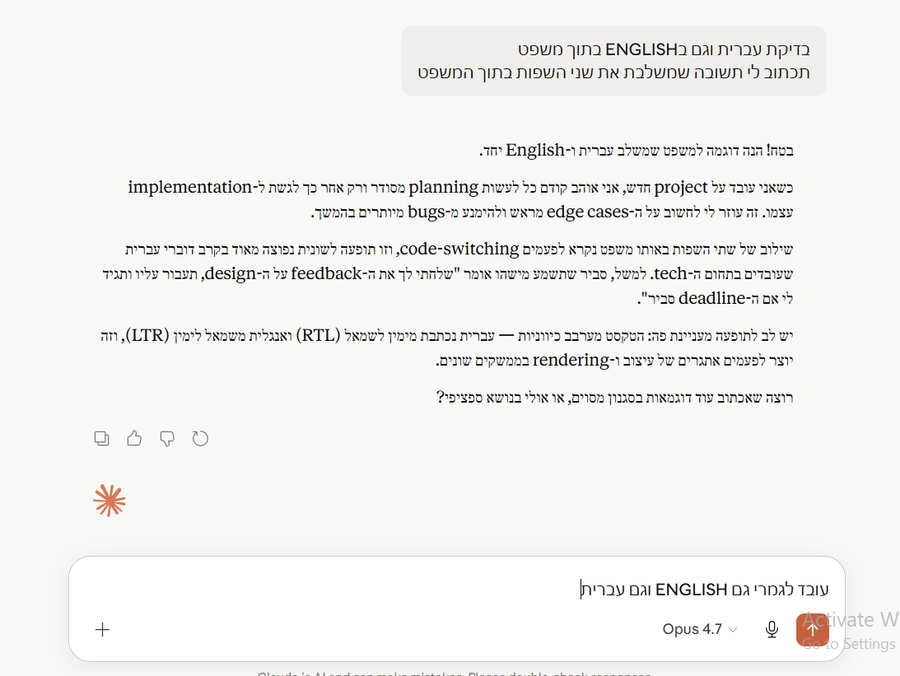
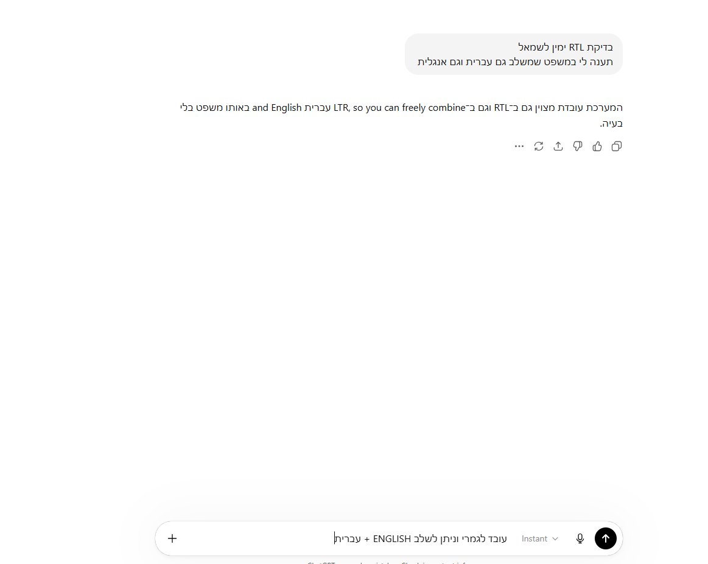
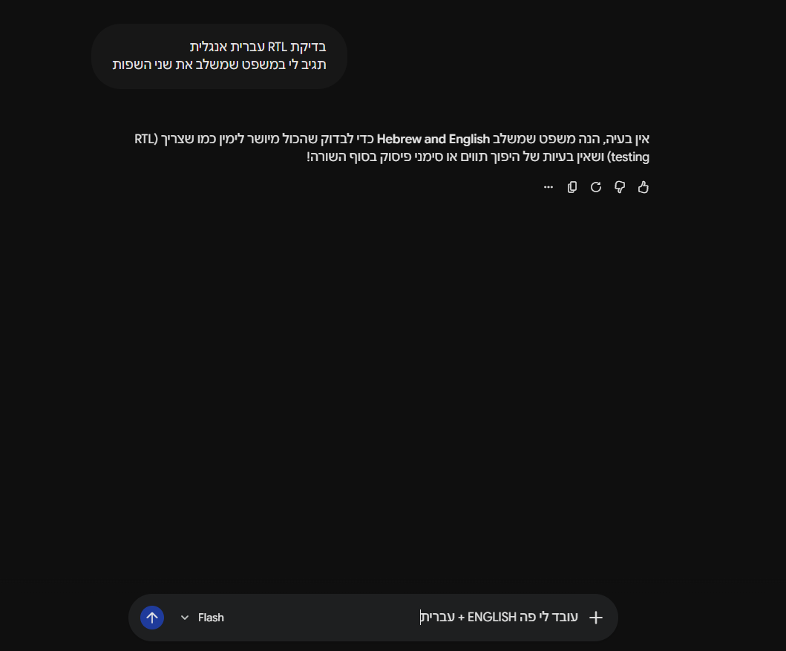
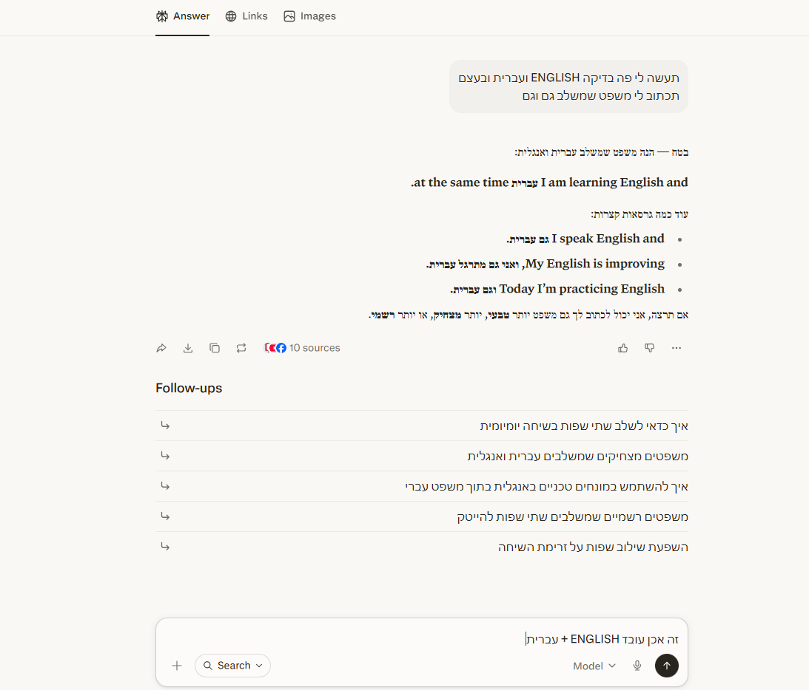
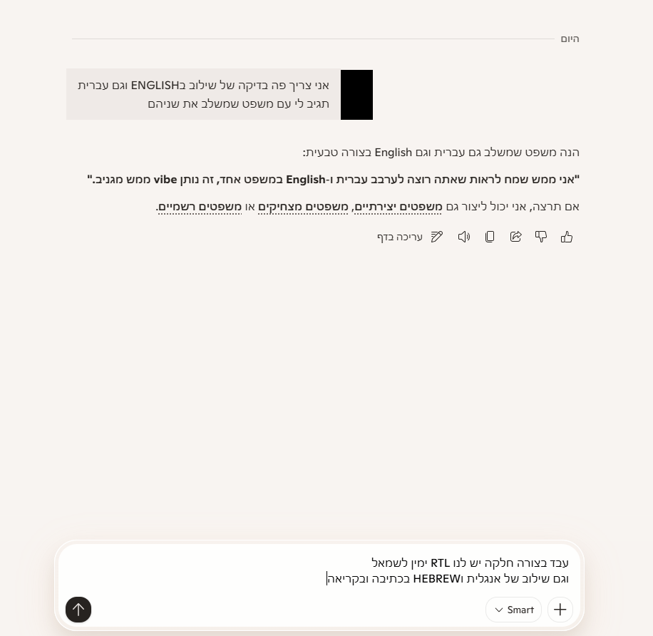
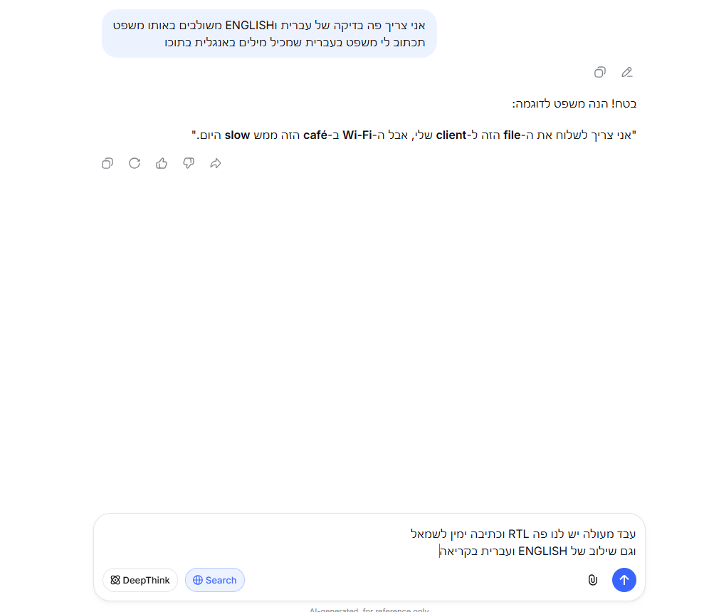
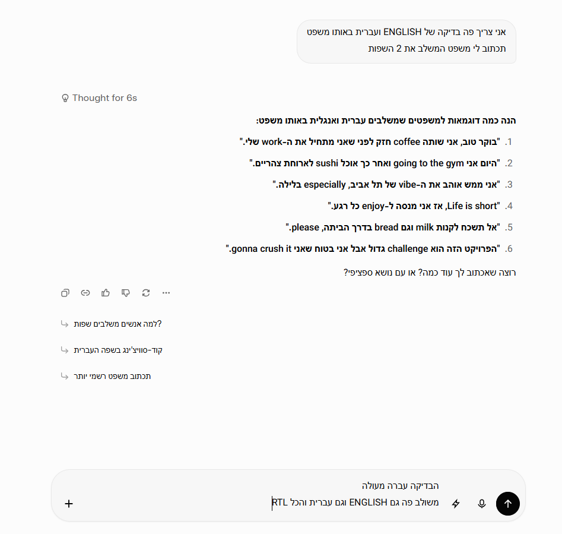
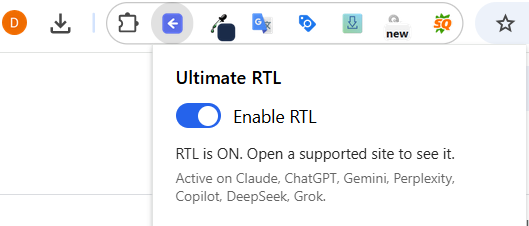

# Ultimate RTL

> A Chrome extension that flips the chat UI of the major AI assistants to
> right-to-left, so people writing in Hebrew, Arabic, Persian and other RTL
> languages can read and type naturally.


🌐 Homepage: [dvirnaaman.co.il](https://dvirnaaman.co.il/)

---

## What it does

Modern AI chat sites render their interface left-to-right. When you write
in Hebrew, Arabic or any right-to-left language, especially mixed with
English words, numbers, or code, the text bounces around: letters jump,
punctuation lands on the wrong side, words look reversed.

Ultimate RTL fixes that by injecting a small stylesheet into the chat
container so the browser's native bidirectional text algorithm can finally
do its job. The user input and the AI's response both read naturally,
right-aligned and correctly ordered.

The extension UI itself is in **English**. This is a tool for anyone who
wants an RTL workflow, not only Hebrew/Arabic speakers.

---

## Screenshots

> Drop your screenshots into `docs/screenshots/` matching the filenames
> below. Each one should show the corresponding site with a mixed
> Hebrew + English chat after the extension is enabled.

### Claude



### ChatGPT



### Gemini



### Perplexity



### Microsoft Copilot



### DeepSeek



### Grok



### Popup



---

## Supported AI assistants

| Site | URL | Selector coverage |
|---|---|---|
| Claude | [claude.ai](https://claude.ai) | Full (real selectors captured) |
| ChatGPT | [chatgpt.com](https://chatgpt.com) | Full (real selectors captured) |
| Gemini | [gemini.google.com](https://gemini.google.com) | Full (real selectors captured) |
| DeepSeek | [chat.deepseek.com](https://chat.deepseek.com) | Full (real selectors captured) |
| Perplexity | [perplexity.ai](https://www.perplexity.ai) | Generic (browser bidi + composer rule) |
| Microsoft Copilot | [copilot.microsoft.com](https://copilot.microsoft.com) | Generic (browser bidi + composer rule) |
| Grok | [grok.com](https://grok.com) | Generic (browser bidi + composer rule) |

Each site has its own config file in `src/sites/<name>.js` and a matching
stylesheet in `src/styles/<name>.css`, so when a site changes its HTML the
fix is a one-file edit. The "Generic" sites have message-level selectors
stubbed out and rely on the browser's bidi algorithm plus a generic
contenteditable rule; capturing their real selectors is a planned
hardening pass (see [Contributing](#contributing)).

Adding a new site is intentionally low-friction. See
[Adding a new site](#adding-a-new-site) below.

---

## Supported languages

Ultimate RTL is direction-agnostic. It doesn't translate or detect
language, it only flips the layout. That means it helps with **any**
language that is written right-to-left, including:

- **Hebrew** (עברית)
- **Arabic** (العربية)
- **Persian / Farsi** (فارسی)
- **Urdu** (اردو)
- **Pashto** (پښتو)
- **Kurdish (Sorani)** (کوردی)
- **Yiddish** (ייִדיש)
- **Aramaic / Syriac** (ܐܪܡܝܐ)
- **Hebrew-script Ladino** (Judeo-Spanish)
- **Mende, N'Ko, Dhivehi**, and any other script written RTL

Mixed-direction text is handled correctly. Each chat message gets
`dir="auto"`, so a Hebrew message reads RTL while an English message in
the same conversation stays LTR. The browser's bidi algorithm does the
work, and Ultimate RTL just gives it the right hints.

---

## Features

- ✅ One simple on/off toggle in the popup. Default ON.
- ✅ Per-message direction detection (`dir="auto"`).
- ✅ Code blocks are explicitly preserved as LTR, so your snippets stay
  readable.
- ✅ Streaming responses are handled by a `MutationObserver`, so new
  message nodes get the RTL treatment as soon as they appear.
- ✅ Toggle state syncs across browsers via `chrome.storage.sync`.
- ✅ Fully offline. No account, no server, no telemetry, no analytics.
- ✅ Open source under the MIT license.
- ✅ Minimal permissions: only the seven supported domains, no
  `<all_urls>`.

---

## Install

### Chrome Web Store

_Coming soon._

### From source (for development)

```bash
git clone https://github.com/DvirNaaman/ultimate-rtl-extension.git
cd ultimate-rtl-extension
npm install
npm run build
```

Then in Chrome:

1. Visit `chrome://extensions`.
2. Turn on **Developer mode** (top right).
3. Click **Load unpacked**.
4. Select the **`dist/`** folder (not the project root).
5. Pin the Ultimate RTL icon in the toolbar, then click it to toggle.

For continuous rebuild during development:

```bash
npm run watch
```

---

## How it works

```
┌────────────────────┐    chrome.storage.sync    ┌────────────────────┐
│   Popup (toggle)   │ ───────────────────────►  │   Service Worker   │
└────────────────────┘                            └──────────┬─────────┘
                                                             │ broadcast
                                                             ▼
┌─────────────────────────────────────────────────────────────────────┐
│  Content script on a matched site:                                  │
│   1. look up site config (selectors)                                │
│   2. inject base + per-site CSS                                     │
│   3. set dir="auto" on each message via MutationObserver            │
└─────────────────────────────────────────────────────────────────────┘
```

- **CSS-first**: most of the work is `direction: rtl; text-align: right;`
  applied to chat content. Code blocks are explicitly held to
  `direction: ltr`.
- **JS-second**: a content script tags newly streamed messages with
  `dir="auto"` so the browser bidi algorithm picks per-message direction.
- **Per-site config**: selectors and tweaks for each site live in their
  own file, so site redesigns are a single-file fix.

Full design: [SPEC.md](SPEC.md). Test plan: [TESTING.md](TESTING.md).

---

## Adding a new site

1. Create `src/sites/<site>.js` with the selector config.
2. Create `src/styles/<site>.css` mirroring those selectors with
   `direction: rtl !important; text-align: right !important;`.
3. Register the config in `src/sites/site-registry.js`.
4. Add the origin to `manifest.json` in three places:
   `host_permissions`, `content_scripts[0].matches`, and
   `web_accessible_resources[0].matches`.
5. Add the hostname to `TARGET_ORIGINS` in
   `src/background/service-worker.js` and to `SUPPORTED_HOSTS` in
   `src/popup/popup.js`.
6. Run `npm run build && node scripts/smoke-check.mjs`. All 75 checks
   must pass.

No core changes required.

---

## Privacy

Ultimate RTL **does not collect, transmit, or store any of your data**.
The only thing it remembers is the on/off toggle state. It does not read
message text, does not talk to any server, has no analytics and no
third-party SDKs.

Full details: [PRIVACY.md](PRIVACY.md).

---

## Project structure

```
ultimate-rtl-extension/
├── manifest.json              MV3 manifest
├── build.mjs                  esbuild driver
├── scripts/
│   └── smoke-check.mjs        automated build verification
├── src/
│   ├── background/            service worker
│   ├── content/               content script + RTL engine + observer
│   ├── sites/                 one config per supported site
│   ├── styles/                base RTL + per-site overrides
│   └── popup/                 the on/off toggle UI
├── icons/                     16 / 48 / 128 PNG + source SVG
├── docs/
│   └── screenshots/           README screenshots
├── README.md
├── SPEC.md                    design & architecture
├── TESTING.md                 manual test plan / DoD
├── PRIVACY.md
├── STORE_LISTING.md           Chrome Web Store submission copy
├── CHANGELOG.md
└── LICENSE                    MIT
```

---

## Contributing

Pull requests welcome. Useful contributions include:

- Capturing real selectors for sites that currently rely on the generic
  composer rule (Perplexity, Copilot, Grok).
- Adding new supported sites. See
  [Adding a new site](#adding-a-new-site).
- Fixing site-specific edge cases (e.g. user-bubble alignment on Gemini
  and Copilot).
- Translations of the popup UI (currently English only by design, but a
  language switcher could be useful).

Before submitting:

1. `npm run build` must succeed.
2. `node scripts/smoke-check.mjs` must show all checks passed.
3. Manually verify the site you touched per [TESTING.md](TESTING.md).

---

## License

[MIT](LICENSE). © 2026 Dvir Naaman.

Free to use, copy, modify, distribute. No warranty.
